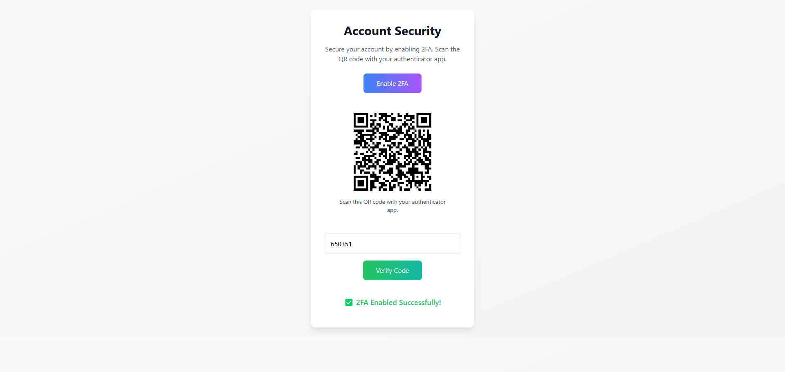

# **TOTP PHP: The Ultimate 2FA Library for PHP**

[](https://github.com/remotemerge/totp-php)
[](https://github.com/remotemerge/totp-php)
[](https://github.com/remotemerge/totp-php)
[](https://sonarcloud.io/summary/overall?id=totp-php&branch=main)
[](https://sonarcloud.io/summary/overall?id=totp-php&branch=main)
[](https://packagist.org/packages/remotemerge/totp-php)
[](https://github.com/remotemerge/totp-php?tab=MIT-1-ov-file)


## **Table of Contents**

| #  | Title                                   | Description                                                                 |
|----|-----------------------------------------|-----------------------------------------------------------------------------|
| 1  | [Why TOTP PHP?](#why-choose-totp-php)   | Ideal for secure logins, data protection, and enhanced user security.       |
| 2  | [Key Features](#key-features)           | Secure secret generation, multi-algorithm support, QR codes, customization. |
| 3  | [Compatibility](#compatibility)         | Works seamlessly with all major authenticator apps and RFC-compliant tools. |
| 4  | [Get Started](#get-started-in-minutes)  | Quick installation via Composer and simple usage examples.                  |
| 5  | [Basic Usage](#basic-usage)             | Generate secrets, TOTP codes, verify codes, and create QR code URIs.        |
| 6  | [Customization](#customization-options) | Change hash algorithms, code length, and time slice duration.               |
| 7  | [Advanced Usage](#advanced-usage)       | Replay protection, secret auditing, discrepancy limits, and QR codes.       |
| 8  | [Try with Docker](#try-with-docker)     | Test locally using Docker for quick setup.                                  |
| 9  | [Try without Docker](#try-with-php)     | Use PHP's built-in server for lightweight local testing.                    |
| 10 | [Getting Help](#getting-help)           | Report bugs, get integration help, or collaborate on projects.              |
| 11 | [Contribution](#contribution)           | Follow coding standards, test code, and submit pull requests.               |
| 12 | [Screenshots](#screenshots)             | Visual demo of the library in action.                                       |

## **Why Choose TOTP PHP?**

TOTP PHP is a versatile, secure, and reliable TOTP library for PHP that provides easy 2FA integration. This developer-friendly, lightweight, and secure library offers simplicity, performance, and customization for secure login systems, data protection, and enhanced user security. TOTP PHP ensures robust protection with ease of use and high performance, designed for modern PHP developers.

---

## **Key Features**

✅ **Secure Secret Generation**
Generates cryptographically secure secret keys for TOTP, ensuring maximum security.

✅ **Multi Algorithm Support**
Supports **SHA1, SHA256, and SHA512** for HMAC hashing, providing flexibility and compatibility with all major authenticator apps.

✅ **QR Code Integration**
Generates **QR codes** for seamless setup in authenticator apps like Google Authenticator, Microsoft Authenticator, Authy, and more.

✅ **Customizable Code Length**
Generates TOTP codes with **6 or 8 digits**, configurable based on application requirements.

✅ **Time Slice Configuration**
Configurable time slice duration (e.g., **30 or 60 seconds**) to match security requirements.

✅ **Discrepancy Verification**
Allows **time slice discrepancy** when verifying TOTP codes, ensuring a smooth user experience. This is especially useful for handling clock drifts.

✅ **Replay Attack Protection**
The `verifyCodeOnce()` method prevents reuse of already-accepted codes by tracking the last accepted time slice, eliminating replay attack vectors.

✅ **Secret Security Auditing**
The `auditSecret()` method inspects a secret key and returns its decoded byte length, strength rating, and actionable warnings — without throwing exceptions.

✅ **Discrepancy Bounds Enforcement**
The discrepancy parameter is validated against a configurable upper bound (default: 10), preventing misconfigured or malicious values from widening the verification window indefinitely.

✅ **Easy Verification**
Verifies TOTP codes with a **simple and intuitive API**, making integration straightforward.

✅ **Lightweight and Fast**
Built for performance, TOTP PHP is **lightweight** and optimized for speed, ensuring minimal overhead.

✅ **Developer Friendly**
Designed with developers in mind, TOTP PHP is **easy to use**, well-documented, and fully tested.

---

## **Compatibility**

TOTP PHP is built to **universal standards** and works seamlessly with **all major authenticator applications** worldwide. Whether users prefer mobile apps, desktop tools, or hardware tokens, this library ensures flawless compatibility across the entire ecosystem.

### **Supported Authenticator Apps**

| 📱 **Mobile Authenticators** | 💻 **Desktop & Hardware** |
|------------------------------|---------------------------|
| ✅ Google Authenticator       | ✅ YubiKey Authenticator   |
| ✅ Microsoft Authenticator    | ✅ FreeOTP                 |
| ✅ Authy                      | ✅ OTP Auth (iOS)          |
| ✅ Duo Mobile                 | ✅ Aegis Authenticator     |
| ✅ 1Password                  | ✅ andOTP                  |
| ✅ LastPass Authenticator     | ✅ Any RFC-compliant tool  |
| ✅ Bitwarden Authenticator    |                           |

### **Standards Compliance**

🔒 **RFC-Compliant Implementation**
TOTP PHP fully adheres to the **IETF otpauth URI specification** and the **Key URI Format standard**, ensuring maximum interoperability with any RFC-compliant two-factor authentication tool. The library works reliably across platforms, devices, and authenticator applications without vendor lock-in.

---

## **Get Started in Minutes**

Adding TOTP PHP to a project is quick and easy. The library requires **PHP 8.1** or higher.

### **Installation**

Install the library via Composer:

```bash
composer require remotemerge/totp-php
```

---

## **Basic Usage**

### **Generate a Secret Key**

```php
use RemoteMerge\Totp\TotpFactory;

// Create a new TOTP instance
$totp = TotpFactory::create();

// Generate a new secret key for the user
$secret = $totp->generateSecret();

// Output the secret key
echo "Generated Secret Key: $secret\n";
```

**Output:**

```text
Generated Secret Key: JBSWY3DPEHPK3PXP
```

### **Generate a TOTP Code**

```php
use RemoteMerge\Totp\TotpFactory;

// Create a new TOTP instance
$totp = TotpFactory::create();

// Example secret key
$secret = 'JBSWY3DPEHPK3PXP';

// Generate a TOTP code
$code = $totp->getCode($secret);

echo "Generated TOTP Code: $code\n";
```

**Output:**

```text
Generated TOTP Code: 123456
```

### **Verify a TOTP Code**

```php
use RemoteMerge\Totp\TotpFactory;

// Create a new TOTP instance
$totp = TotpFactory::create();

// Example secret key and code
$secret = 'JBSWY3DPEHPK3PXP';
$code = '123456';

// Verify the code
$isValid = $totp->verifyCode($secret, $code);

echo $isValid ? "✅ Code is valid!\n" : "❌ Code is invalid!\n";
```

**Output:**

```text
✅ Code is valid!
```

### **Generate a QR Code URI**

```php
use RemoteMerge\Totp\TotpFactory;

// Create a new TOTP instance
$totp = TotpFactory::create();

// Example secret key and user information
$secret = 'JBSWY3DPEHPK3PXP';
$uri = $totp->generateUri($secret, 'user@example.com', 'YourApp');

echo "QR Code URI: $uri\n";
```

**Output:**

```text
QR Code URI: otpauth://totp/YourApp:user%40example.com?secret=JBSWY3DPEHPK3PXP&issuer=YourApp&algorithm=SHA1&digits=6&period=30
```

---

## **Customization Options**

### **Change the Hash Algorithm**

By default, TOTP PHP uses **SHA1**. The algorithm can be configured to use **SHA256** or **SHA512**:

```php
use RemoteMerge\Totp\TotpFactory;

$totp = TotpFactory::create();

// Configure the algorithm
$totp->configure(['algorithm' => 'SHA256']);

$secret = $totp->generateSecret();
$code = $totp->getCode($secret);

echo "Generated TOTP Code (SHA256): $code\n";
```

### **Change the Code Length**

By default, TOTP PHP generates **6-digit codes**. The length can be configured to **8 digits**:

```php
use RemoteMerge\Totp\TotpFactory;

$totp = TotpFactory::create();

// Configure the code length
$totp->configure(['digits' => 8]);

$secret = $totp->generateSecret();
$code = $totp->getCode($secret);

echo "Generated 8-Digit TOTP Code: $code\n";
```

### **Change the Time Slice Duration**

By default, TOTP PHP uses a **30-second time slice**. The duration can be configured to **60 seconds**:

```php
use RemoteMerge\Totp\TotpFactory;

$totp = TotpFactory::create();

// Configure the time slice duration
$totp->configure(['period' => 60]);

$secret = $totp->generateSecret();
$code = $totp->getCode($secret);

echo "Generated TOTP Code (60-second period): $code\n";
```

---

## **Advanced Usage**

### **Verify Code with Discrepancy**

Handle clock drift by allowing a discrepancy of **±1 time slice**:

```php
use RemoteMerge\Totp\TotpFactory;

$totp = TotpFactory::create();

$secret = 'JBSWY3DPEHPK3PXP';
$code = '123456';

// Allow discrepancy of 1 time slice
$isValid = $totp->verifyCode($secret, $code, 1);

echo $isValid ? "✅ Code is valid!\n" : "❌ Code is invalid!\n";
```

### **Replay Attack Protection**

Use `verifyCodeOnce()` to prevent a TOTP code from being accepted more than once. It returns the matched time slice on success (store this value and pass it back on the next login), or `null` if the code is invalid or has already been used:

```php
use RemoteMerge\Totp\TotpFactory;

$totp = TotpFactory::create();

$secret = 'JBSWY3DPEHPK3PXP';
$code = '123456';

// Load the last accepted time slice from persistent storage (e.g. database).
// Use 0 on first login.
$lastAcceptedSlice = (int) $user->getLastTotpSlice();

$newSlice = $totp->verifyCodeOnce($secret, $code, $lastAcceptedSlice);

if ($newSlice === null) {
    echo "❌ Code is invalid or has already been used!\n";
} else {
    // Persist the new slice to block future reuse of this code.
    $user->setLastTotpSlice($newSlice);
    echo "✅ Code accepted!\n";
}
```

### **Secret Security Audit**

Use `auditSecret()` to inspect a secret key before storing or using it. The method never throws — all diagnostics are returned in the result array:

```php
use RemoteMerge\Totp\TotpFactory;

$totp = TotpFactory::create();

$secret = 'JBSWY3DPEHPK3PXP';

$audit = $totp->auditSecret($secret);

echo "Decoded length: {$audit['length_bytes']} bytes\n";
echo "Strong secret: " . ($audit['is_strong'] ? 'Yes' : 'No') . "\n";

foreach ($audit['warnings'] as $warning) {
    echo "⚠️  Warning: $warning\n";
}
```

**Output:**

```text
Decoded length: 10 bytes
Strong secret: No
⚠️  Warning: Secret is weak (10 bytes); recommend >= 20 bytes for adequate security.
```

### **Configuring the Maximum Discrepancy**

By default the discrepancy parameter in `verifyCode()` and `verifyCodeOnce()` is capped at **10**. Pass `max_discrepancy` to the constructor to tighten or relax this limit:

```php
use RemoteMerge\Totp\Totp;

// Restrict the maximum allowed discrepancy to 2 time slices
$totp = new Totp(['max_discrepancy' => 2]);

$secret = $totp->generateSecret();
$code = $totp->getCode($secret);

// discrepancy of 1 is within the limit — works normally
$isValid = $totp->verifyCode($secret, $code, 1);

// discrepancy of 3 exceeds the limit — throws TotpException
$totp->verifyCode($secret, $code, 3);
```

### **Generate a QR Code Image**

Use the QR code URI to generate a QR code image:

```php
use RemoteMerge\Totp\TotpFactory;

$totp = TotpFactory::create();

$secret = 'JBSWY3DPEHPK3PXP';
$uri = $totp->generateUri($secret, 'user@example.com', 'YourApp');

$qrCodeUrl = "https://api.qrserver.com/v1/create-qr-code/?size=200x200&data=" . urlencode($uri);

echo "QR Code Image URL: $qrCodeUrl\n";
```

---

## **Try with Docker**

Test the TOTP PHP library locally using Docker. This method automatically sets up the environment with all dependencies. Follow these steps:

1. Clone the repository:

   ```bash
   git clone git@github.com:remotemerge/totp-php.git
   cd totp-php
   ```

2. Start the Docker container:

   ```bash
   bash start-docker.sh
   ```

3. Access the application at `http://localhost:8080`.

4. (Optional) Access the container shell for development:

   ```bash
   bash pkg-cli.sh
   ```

---

## **Try with PHP**

For a lightweight setup, use PHP's built-in server. This method is ideal for quick local testing and doesn't require Docker. Follow these steps:

1. Clone the repository:

   ```bash
   git clone git@github.com:remotemerge/totp-php.git
   cd totp-php
   ```

2. Install dependencies using Composer:

   ```bash
   composer install
   ```

3. Start the PHP built-in server:

   ```bash
   php -S localhost:8080 -t public
   ```

4. Access the application at `http://localhost:8080`.

---

## **Getting Help**

Bugs and feature requests are tracked using GitHub issues and prioritized to ensure the library remains reliable and up to date.

- **Bug Reports**
  Issues can be reported by [opening an issue](https://github.com/remotemerge/totp-php/issues/new) on GitHub. All issues are addressed diligently to maintain the library's quality.

- **Integration Assistance**
  For assistance with integration or questions about features, please open a GitHub issue or discussion.

---

## **Contribution**

Contributions from the **Open Source community** are highly valued and appreciated. To ensure a smooth and efficient process, contributors should adhere to the following guidelines:

- **Coding Standards**: Code must adhere to [PER Coding Style 3.0](https://www.php-fig.org/per/coding-style/) standards.
- **Testing**: All submitted code must pass relevant tests to maintain the library's reliability.
- **Documentation**: Proper documentation and clean code practices are essential for maintainability.
- **Pull Requests**: Pull requests should be made to the `main` branch.

All contributions are reviewed and appreciated.

## **Screenshots**


