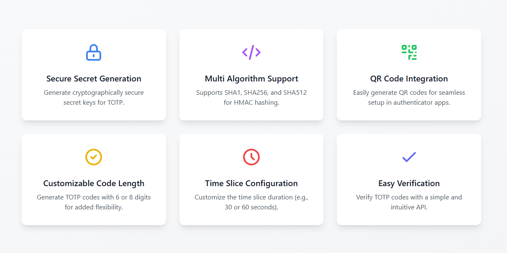

# **TOTP PHP: The Ultimate 2FA Library for PHP**

[)](https://twitter.com/sapkotamadan)
[](https://www.facebook.com/NextSapkotaMadan)


[](https://packagist.org/packages/remotemerge/totp-php)




## **Why Choose TOTP PHP?**

Looking for a versatile, secure, and reliable TOTP library for PHP that provides easy 2FA integration? TOTP PHP is your ultimate solution for seamless 2FA implementation. This developer friendly, lightweight, and secure library offers unmatched simplicity, performance, and customization, making it perfect for secure login systems, data protection, and enhanced user security. Whether you're safeguarding login systems, securing sensitive data, or enhancing user security, TOTP PHP ensures robust protection with exceptional ease of use and high performance, tailored for modern PHP developers.

---

## **Key Features**

✅ **Secure Secret Generation**  
Generate cryptographically secure secret keys for TOTP, ensuring maximum security for your users.

✅ **Multi Algorithm Support**  
Supports **SHA1, SHA256, and SHA512** for HMAC hashing, giving you flexibility and compatibility with all major authenticator apps.

✅ **QR Code Integration**  
Easily generate **QR codes** for seamless setup in authenticator apps like Google Authenticator, Microsoft Authenticator, Authy, and more.

✅ **Customizable Code Length**  
Generate TOTP codes with **6 or 8 digits**, tailored to your application's needs.

✅ **Time Slice Configuration**  
Customize the time slice duration (e.g., **30 or 60 seconds**) to match your security requirements.

✅ **Discrepancy Verification**
Allow a **time slice discrepancy** when verifying TOTP codes, ensuring a smooth user experience. This is especially useful for handling clock drifts.

✅ **Easy Verification**  
Verify TOTP codes with a **simple and intuitive API**, making integration a breeze.

✅ **Lightweight and Fast**  
Built for performance, TOTP PHP is **lightweight** and optimized for speed, ensuring minimal overhead.

✅ **Developer Friendly**  
Designed with developers in mind, TOTP PHP is **easy to use**, well-documented, and fully tested.

---

## **Get Started in Minutes**

Adding TOTP PHP to your project is quick and easy. Here's how:

### **Installation**

Install the library via Composer:

```bash
composer require remotemerge/totp-php
```

---

## **Basic Usage**

### **Generate a Secret Key**

```php
use RemoteMerge\Totp\TotpFactory;

// Create a new TOTP instance
$totp = TotpFactory::create();

// Generate a new secret key for the user
$secret = $totp->generateSecret();

// Output the secret key
echo "Generated Secret Key: $secret\n";
```

**Output:**

```
Generated Secret Key: JBSWY3DPEHPK3PXP
```

### **Generate a TOTP Code**

```php
use RemoteMerge\Totp\TotpFactory;

// Create a new TOTP instance
$totp = TotpFactory::create();

// Replace with your secret key
$secret = 'JBSWY3DPEHPK3PXP';

// Generate a TOTP code
$code = $totp->getCode($secret);

echo "Generated TOTP Code: $code\n";
```

**Output:**

```
Generated TOTP Code: 123456
```

### **Verify a TOTP Code**

```php
use RemoteMerge\Totp\TotpFactory;

// Create a new TOTP instance
$totp = TotpFactory::create();

// Replace with your secret key and the code to verify
$secret = 'JBSWY3DPEHPK3PXP';
$code = '123456';

// Verify the code
$isValid = $totp->verifyCode($secret, $code);

echo $isValid ? "✅ Code is valid!\n" : "❌ Code is invalid!\n";
```

**Output:**

```
✅ Code is valid!
```

### **Generate a QR Code URI**

```php
use RemoteMerge\Totp\TotpFactory;

// Create a new TOTP instance
$totp = TotpFactory::create();

// Replace with your secret key and user information
$secret = 'JBSWY3DPEHPK3PXP';
$uri = $totp->generateUri($secret, 'user@example.com', 'YourApp');

echo "QR Code URI: $uri\n";
```

**Output:**

```
QR Code URI: otpauth://totp/YourApp:user@example.com?secret=JBSWY3DPEHPK3PXP&issuer=...
```

---

## **Customization Options**

### **Change the Hash Algorithm**

By default, TOTP PHP uses **SHA1**. You can switch to **SHA256** or **SHA512**:

```php
use RemoteMerge\Totp\TotpFactory;

$totp = TotpFactory::create();

// Configure the algorithm
$totp->configure(['algorithm' => 'sha256']);

$secret = $totp->generateSecret();
$code = $totp->getCode($secret);

echo "Generated TOTP Code (SHA256): $code\n";
```

### **Change the Code Length**

By default, TOTP PHP generates **6-digit codes**. You can switch to **8-digit codes**:

```php
use RemoteMerge\Totp\TotpFactory;

$totp = TotpFactory::create();

// Configure the code length
$totp->configure(['digits' => 8]);

$secret = $totp->generateSecret();
$code = $totp->getCode($secret);

echo "Generated 8-Digit TOTP Code: $code\n";
```

### **Change the Time Slice Duration**

By default, TOTP PHP uses a **30-second time slice**. You can switch to **60 seconds**:

```php
use RemoteMerge\Totp\TotpFactory;

$totp = TotpFactory::create();

// Configure the time slice duration
$totp->configure(['period' => 60]);

$secret = $totp->generateSecret();
$code = $totp->getCode($secret);

echo "Generated TOTP Code (60-second period): $code\n";
```

---

## **Advanced Usage**

### **Verify Code with Discrepancy**

Handle clock drift by allowing a discrepancy of **±1 time slice**:

```php
use RemoteMerge\Totp\TotpFactory;

$totp = TotpFactory::create();

$secret = 'JBSWY3DPEHPK3PXP';
$code = '123456';

// Allow discrepancy of 1 time slice
$isValid = $totp->verifyCode($secret, $code, 1);

echo $isValid ? "✅ Code is valid!\n" : "❌ Code is invalid!\n";
```

### **Generate a QR Code Image**

Use the QR code URI to generate a QR code image:

```php
use RemoteMerge\Totp\TotpFactory;

$totp = TotpFactory::create();

$secret = 'JBSWY3DPEHPK3PXP';
$uri = $totp->generateUri($secret, 'user@example.com', 'YourApp');

$qrCodeUrl = "https://api.qrserver.com/v1/create-qr-code/?size=200x200&data=" . urlencode($uri);

echo "QR Code Image URL: $qrCodeUrl\n";
```

---

## **Try with Docker**

Test the TOTP PHP library locally using Docker. This method automatically sets up the environment with all dependencies. Follow these steps:

1. Clone the repository:
   ```bash
   git clone git@github.com:remotemerge/totp-php.git
   cd totp-php
   ```

2. Start the Docker container:
   ```bash
   ddocker compose down && docker compose up
   ```

3. Access the application at `http://localhost:8080`.

---

## **Try without Docker (PHP Server)**

For a lightweight setup, use PHP's built-in server. This method is ideal for quick local testing and doesn’t require Docker. Follow these steps:

1. Clone the repository:
   ```bash
   git clone git@github.com:remotemerge/totp-php.git
   cd totp-php
   ```

2. Install dependencies using Composer:
   ```bash
   composer install
   ```

3. Start the PHP built-in server:
   ```bash
   php -S localhost:8080 -t public
   ```

4. Access the application at `http://localhost:8080`.

---

## **Getting Help**

Bugs and feature requests are tracked using GitHub issues, and they are prioritized to ensure the library remains reliable and up-to-date.

* **Found a Bug?**  
  If you encounter any issues, please [open an issue](https://github.com/remotemerge/totp-php/issues/new) on GitHub. Every issue is addressed diligently to maintain the library's quality.

* **Need Help with Integration?**  
  For assistance integrating TOTP PHP into your application or questions about its features, feel free to reach out. Helping developers build secure and efficient systems is a top priority.

* **Interested in Collaboration?**  
  If this library impresses you, and you're looking for a skilled PHP developer to join your team or collaborate on a project, let's connect and build something amazing together.

---

## **Contribution**

The contributions of the **Open Source community** are highly valued and appreciated. To ensure a smooth and efficient process, please adhere to the following guidelines when submitting code:

- **Coding Standards**: Ensure that the code adheres to [PER Coding Style 2.0](https://www.php-fig.org/per/coding-style/) standards.
- **Testing**: All submitted code must pass relevant tests to maintain the library’s reliability.
- **Documentation**: Proper documentation and clean code practices are essential for maintainability.
- **Pull Requests**: Please make pull requests to the `main` branch.

Thank you for your support and contributions. Looking forward to reviewing your code and building something amazing together!
